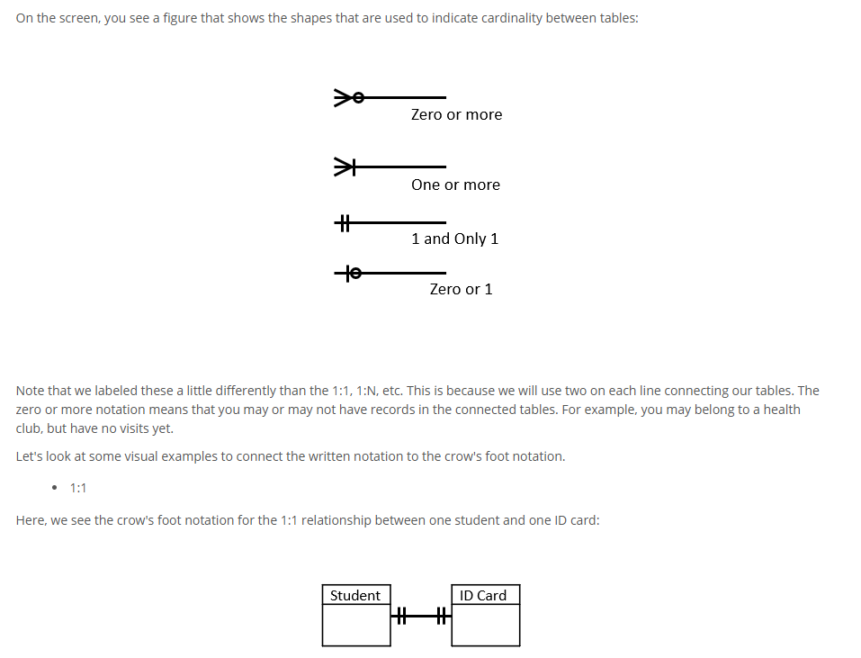
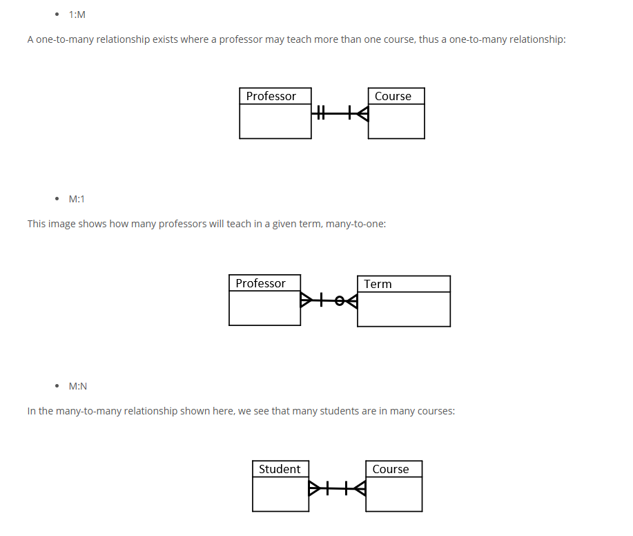

Look at  204 || 303 -> Ch2.md for more content

### Section 1: Entities in Database Design

#### What Is an Entity?

* An **entity** is an object that exists and about which data is to be captured or stored.
* In databases, an entity represents a **thing, person, place, or object** relevant to the system's purpose.
* Example entities in an employee database: **Employees**, **Health Plan Enrollment**.
* Entities appear in **Entity Relationship Diagrams (ERDs)** to illustrate how they relate.

#### Defining an Entity

* Only items for which data will be stored should be considered entities.
* Examples:

  * **Employee**: represents a person in the organization.
  * **Work Location** or **Benefit Plan** may be entities or attributes depending on design needs.

#### Entity Attributes

* **Attributes** are characteristics or data points about an entity.
* Examples for an **Employee** entity:

  * Name
  * Employee ID
  * Health Plan Enrollment
  * Work Location
* Each attribute has a **domain**: the set of possible values (text, number, date, etc.).
* Example domains:

  * Name: Jane Doe
  * Employee ID: 123456
  * Health Plan Enrollment: Premium Plan

#### Keys in Entities

* **Key**: A special attribute (or set of attributes) that uniquely identifies each entity.

  * Example: Employee ID or Social Security Number.
* Keys are **unique domains** and should be used to ensure data integrity.

#### Deciding Between Entity and Attribute

* Use the following questions to decide:

  * Is it **core to the database's purpose**?

    * If yes → may be an entity.
    * Example: Work location might be an attribute if the focus is employees.
  * Does it have **components** of its own?

    * If yes → may be an entity.
    * Example: Health Plan with coverage options and effective dates.
  * Can it have **multiple instances** per main entity?

    * If yes → consider as separate entity.
    * Example: Multiple email addresses per employee.
  * Is the data **frequently blank**?

    * If yes → better as a separate entity to avoid sparse tables.
    * Example: Optional benefits like Flexible Spending Accounts.

#### Relationships Between Entities

* Entities are connected via **relationships**.
* Example:

  * Entities: Employee and Benefit Plan.
  * Relationship: **Enrolls In**.
* Relationships define how entities interact and provide **structure and linkage** in databases.
* Many-to-many relationships often require a **junction table** (e.g., EmployeeBenefits).

#### Summary

* An **entity** is an object in the database with meaningful data.
* **Attributes** define entity details; some attributes may evolve into entities.
* **Keys** (unique identifiers) maintain entity uniqueness.
* Relationships **link entities**, enabling meaningful database interactions.
* Entity vs. Attribute decisions depend on **relevance**, **complexity**, **multiplicity**, and **data sparsity**.

### Section 2: The Need for Databases and Their Structure

#### Why Databases Are Essential

* Without databases, information would be stored in physical formats (e.g., books), making data retrieval slow and inefficient.
* Example: An airport clerk searching through paper logs for flight availability illustrates the need for electronic databases.

#### What Are Relational Databases?

* **Relational Databases**: Electronic tables that organize large volumes of related data in a structured format.
* Tables resemble spreadsheets:

  * **Rows** = **Tuples**: Each row represents a single data item.
  * **Columns** = **Attributes**: Each column represents a characteristic of the data item.
* Example:

  * **Tuple**: A flight.
  * **Attributes**: Flight number, arrival time, departure time, departure city, arrival city.

#### Primary Keys

* **Primary Key**: A column (or set of columns) that uniquely identifies each row in a table.
* Example: In a flight table, **Flight Number** is the primary key — it uniquely identifies each flight.
* Attributes associated with Flight Number:

  * Departure City
  * Departure Date/Time
  * Arrival City
  * Arrival Date/Time

#### Strong vs. Weak Entities

* **Strong Entity**:

  * Has a **primary key**.
  * Exists independently.
  * Example: **Employee**.
* **Weak Entity**:

  * Does **not** have a unique primary key on its own.
  * Relies on a strong entity for identification.
  * Example: **Paycheck** (depends on Employee).

#### Composite Keys

* A **Composite Key** is a combination of two or more attributes that together uniquely identify a row.
* Example:

  * Table: Convention Events.
  * Attributes: Room Number + Time.
  * Neither is unique alone, but together form a unique identifier.
* Tables with composite keys are considered **weak entities**.

#### Functional Dependency

* **Functional Dependency**: Every attribute in a table must be dependent on the primary key.
* All attributes must contribute to fully describing the entity identified by the primary key.
* Example:

  * In a flight table, removing 'Arrival Time' breaks the functional dependency.
  * The table no longer fully describes the flight, weakening its integrity.

#### Summary

* Relational databases organize data into **tables** with **tuples (rows)** and **attributes (columns)**.
* Each table has a **primary key** to uniquely identify its entries.
* **Strong entities** have primary keys and stand alone; **weak entities** depend on strong entities and may use **composite keys**.
* Tables must maintain **functional dependency**: all attributes must be necessary to describe the primary key completely.

### Section 3: Database Cardinality and Crow's Foot Notation

#### What Is Cardinality?

* **Cardinality** defines the number of relationships between rows in two database tables.
* Common relationship types:

  * **One-to-One (1:1)**: Each entity instance in Table A relates to one in Table B.

    * Example: One student ↔ One ID card.
  * **One-to-Many (1\:M)**: One record in Table A relates to multiple in Table B.

    * Example: One professor ↔ Teaches many courses.
  * **Many-to-One (M:1)**: Many records in Table A relate to one in Table B.

    * Example: Many professors ↔ One term.
  * **Many-to-Many (M\:N)**: Many records in Table A relate to many in Table B.

    * Example: Many students ↔ Many courses.

#### Cardinality Notation

* Text-based Notation:

  * One-to-One → **1:1**
  * One-to-Many → **1\:M**
  * Many-to-One → **M:1**
  * Many-to-Many → **M\:N** (also M\:M or N\:M)

#### Crow’s Foot Notation

* Used in **Entity Relationship Diagrams (ERDs)** to graphically represent relationships.
* Visual symbols:

  * **Straight line**: exactly one.
  * **Crow’s foot**: many.
  * **Circle**: zero (optional).
* Examples:

  * **1:1** → Line + Line
  * **1\:M** → Line + Crow’s Foot
  * **M:1** → Crow’s Foot + Line
  * **M\:N** → Crow’s Foot + Crow’s Foot
    To indicate many-to-many. It's often noted as N:M or M:N

#### Intersection (Junction) Tables

* Used to resolve **many-to-many (M\:N)** relationships.
* These tables:

  * Break M\:N into two 1\:M relationships.
  * Include **foreign keys** from both related tables.
* Example:

  * Tables: **Course** and **Term**.
  * M\:N relationship resolved with **CourseTerm** table:

    * Attributes: CourseID, TermID.
    * Both act as foreign keys and often form a composite primary key.

#### Summary

* **Cardinality** explains the numerical relationships between entities.
* Relationship types: 1:1, 1\:M, M:1, M\:N.
* **Crow’s foot notation** visualizes these relationships in ERDs.
* **Intersection tables** are essential for managing many-to-many relationships, ensuring clear structure and referential integrity.

### Section 4: Entity Relationship Diagram (ERD)

#### What Is an ERD?

* An **Entity Relationship Diagram (ERD)** is a **visual representation** of the structure of a relational database.
* It shows:

  * **Entities** (tables)
  * **Attributes** (columns)
  * **Relationships** (cardinality between entities)

#### Key Components of an ERD

* **Entities**: Represented as **rectangles**. These are the tables (e.g., Student, Professor).
* **Attributes**: Represented as **ovals**. These describe the properties of the entities (e.g., Student ID, Course Code).
* **Relationships**: Represented as **diamonds** and connected via lines between entities.
* **Cardinality** is labeled on connecting lines or shown with **crow’s foot notation**.

#### Example Entity Relationships

* **Student ↔ ID Card**: 1:1
* **Professor ↔ Courses**: 1\:M
* **Professors ↔ Term**: M:1
* **Students ↔ Classes**: M\:N (requires intersection table)
* **Courses ↔ Terms**: M\:N (resolved with **CourseTerm** table)

#### Steps to Create an ERD

1. **Identify Entities**:

   * Use **rectangles**.
   * Example: Student, Professor, Course, Term.

2. **Define Relationships**:

   * Use **diamonds** for verbs like “teaches,” “enrolls,” “has.”
   * Connect these to entities with **lines**.
   * Add **crow’s foot notation** for cardinality.

3. **Add Attributes**:

   * Use **ovals** to represent data columns.
   * Connect to the appropriate entity.
   * Example: Student → StudentID, Name; Course → CourseCode, Title.

4. **Address M\:N Relationships**:

   * Use **intersection tables** to normalize.
   * Example: CourseTerm with attributes CourseID and TermID.

5. **Optimize Layout**:

   * Rearrange for clarity and minimize line crossing.
   * Ensure cardinality is clearly marked.

#### Crow’s Foot Variation

* An alternative ERD style uses **crow’s foot symbols** directly on the connecting lines, eliminating the need for diamonds and ovals.
* Useful for quick visual identification of:

  * 1:1 (single line)
  * 1\:M (line + crow’s foot)
  * M\:N (crow’s foot on both ends)

#### Summary

* An **ERD** maps the structure and logic of a relational database.
* It includes **entities**, **attributes**, and **relationships**.
* **Cardinality** (1:1, 1\:M, M:1, M\:N) is a core concept visualized using symbols or crow’s foot notation.
* ERDs help identify relational issues, normalize data, and clarify database design.

